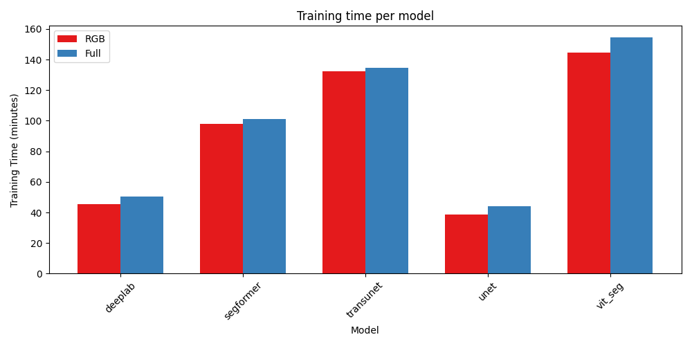

# Abstract

We evaluate several semantic-segmentation architectures on a
deforestation-driver machine learning competition hosted by Solafune.
Our pipeline applies a conversion of annotated polygons into tensor masks,
standard image augmentations,
and a minimum-area filter in post-processing.
We compare UNet, DeepLabV3+, SegFormer, Vision Transformer (ViT), TransUNet,
and two ensemble variants in terms of segmentation accuracy (pixel-wise F1) and computational cost.
DeepLabV3+ trained on all 12 Sentinel-2 bands achieved the highest validation F1 (0.7367)
and earned 0.5851 and 0.5624 on the public and private leaderboards, respectively.
Contrary to expectations, larger architectures did not outperform smaller ones under
our resource constraints. We analyze this behavior, attribute it to overfitting and 
limited fine-tuning of huge backbones,
and discuss how more extensive tuning and data could better realize their potential.

# Introduction

In this paper we are working on the task of identifying deforestation drivers.
This is part of a Solafune ML competition[^1] where the goal is to classify and 
segment drivers of deforestation in satellite imagery.

Several architectures have been developed for image segmentation in different fields,
such as UNet [@ronneberger2015unetconvolutionalnetworksbiomedical] and TransUNet [@chen2021transunet]
for medical image segmentation, or the Segformer [@xie2021segformer] for general purpose 
segmentation.

We have several goals we want to achieve. First, achieve the best possible performance
on the competition dataset. 
Second, compare the different implementations in terms of performance vs computational cost.
Lastly, to reproduce results reported in the original architecture papers, which we 
have implemented.

Our contributions consist of applying different segmentation model architectures 
on a deforestation segmentation task, and comparing their performance.

[^1]: [Competition website](https://solafune.com/competitions/68ad4759-4686-4bb3-94b8-7063f755b43d?menu=about&tab=&modal=%22%22)

# Methods

Our entire pipeline is based upon a GitHub repository made by motokimura.[^2]
We have made a couple of modifications to the training and evaluation pipeline,
but the pre- and post-processing steps remain mostly unchanged.

[^2]: [Baseline pipeline by motokimura](https://github.com/motokimura/solafune_deforestation_baseline)

## Pre-processing

The competition data comes in the form of annotated polygons in a json file.
We convert those into tensors of 4 channels.
We apply standard image augmentations such as flipping, scaling and rotation.
Additionally we apply random cropping reducing the input image by half.
The cropping is not applied for the Vision Transformer (ViT) model.
Images are also normalized using mean and standard deviation calculated from
training images. Normalization values depend on the number of input channels, i.e. 
using only RGB or all channels.

## Post-processing

We applied a score threshold of 0.5 to binarize the predicted masks.
Additionally, we discard masks smaller than 10,000 pixels during inference.
The idea is that removing small segmentations reduces the 
number of false positive predictions.

## Model architectures

We have applied the following model architectures; UNet, DeepLabV3+, Vision Transformer (ViT), 
Segformer, and TransUNet.
We used the Pytorch Segmentation Models library [@Iakubovskii:2019] to implement UNet,
DeepLabV3+, and Segformer, while ViT and TransUNet are implemented following 
their respective papers and source code.

### Vision Transformer (ViT)

The Vision Transformer (ViT) model treats an image as a sequence of
fixed-sized patches and processes them with a standard Transformer encoder.
It relies on self-attention instead of convolutional inductive biases
to learn long-range dependencies.

#### ViT architecture

The Vision Transformer breaks an image into fixed size patches,
linearly embeds each patch (plus a learnable class token and positional embeddings) into vectors.
The result of this is then fed as a sequence through standard Transformer
encoder layers that contains multi-head self-attention followed by
feed-forward networks, using the final class token as representation for prediction.
Its architecture can be seen in Figure \ref{vit}

#### ViT implementation 

In our ViT implementation we started from the torchvision ViT-B/16
model pretrained on ImageNet [@dosovitskiy2020vit] swapped its first layer
to accept all 12 Sentinel-2 bands, resized its built-in positional embeddings
to our 1024×1024 image grid, and replaced the classification head with
a lightweight segmentation head for four classes.

#### Why ViT?

Based on [@dosovitskiy2020vit] the ViT applies a pure Transformer to image patches and,
with large-scale pre-training, matches or exceeds CNNs on vision benchmarks.
Since our task requires capturing long-range,
multispectral context in high-resolution satellite imagery,
we wanted to see if ViT could similarly improve segmentation performance.

![Vision Transformer Architecture [@dosovitskiy2020vit]\label{vit}](../vision_transformer/vitimg.png){width=80%}

### Segformer

SegFormer [@xie2021segformer] is a transformer-based architecture designed for efficient semantic segmentation.
It combines the strengths of hierarchical representations from convolutional networks with the global context modeling of transformers.
In our project, we included SegFormer as one of the core models to evaluate its ability to identify deforestation drivers in satellite imagery.

#### Segformer architecture

SegFormer consists of two main components (Figure \ref{segformer_arch}): the Mix Transformer (MiT) encoder and a lightweight MLP-based decoder. The encoder is optimized for visual tasks, using overlapping patch embeddings and a hierarchical structure to effectively capture both local and global image features. Unlike traditional Vision Transformers, SegFormer replaces explicit positional encodings with Mix-FFN modules, improving robustness to varying input resolutions.

The decoder is composed entirely of Multi-Layer Perceptrons (MLPs),
which aggregate multi-scale features from the encoder.
This design keeps the decoder lightweight while maintaining strong segmentation performance.

#### Segformer implementation

We used the implementation of SegFormer provided by the *segmentation_models* library [@Iakubovskii:2019],
which integrates smoothly with PyTorch and supports modular experimentation.
This allowed us to quickly prototype and evaluate different model variants under our unified training and evaluation pipeline.

#### Why SegFormer?

We selected the SegFormer-B5 variant, which is the most powerful configuration of the architecture.
Its deep encoder is particularly effective at capturing both fine-grained and large-scale features,
making it well suited for complex segmentation tasks like deforestation mapping.
In addition, SegFormer has demonstrated strong benchmark results on datasets such as Cityscapes and ADE20K,
indicating reliable generalization to a variety of segmentation domains.

![Segformer architecture [@xie2021segformer]\label{segformer_arch}](./imgs/segformer_arch.png){width=80%}

### TransUNet

#### TransUNet architecture 

TransUNet is very similar to its predecessor UNet.
It consists of an encoder and decoder architecture,
where the main difference is the introduction of a
transformer in the encoder as seen in Figure \ref{transunet_arch}. 
The decoder block called CUP, short for Cascaded Upsampler,
consists of multiple upsampling blocks,
which are made up of a 2x bilinear upsampler followed by two 
convolutional blocks.
The decoder also uses skip connections from the CNN encoder,
passing them into the first convolutional block at each upsampling stage.

#### TransUNet implementation

In our implementation we use ResNet50-VisionTransformer for the hybrid encoder,
using pre-trained weights loaded from the `timm` library [@rw2019timm].
We implement the base version of TransUNet as they do in [@chen2021transunet].
Because our inputs have three or more channels, we replaced the ResNet encoder's 
first convolutional layer; the rest of the hybrid encoder remained unchanged.

#### Why TransUNet?

According to [@chen2021transunet], TransUNet is an improvement to UNet for the task of medical image 
segmentation. Since we use UNet as one of our baseline models, we were interested 
to see if we could get similar results for our task.

![TransUNet architecture [@chen2021transunet]\label{transunet_arch}](../trans_unet/img/transunet.png){width=80%}

## Ensemble models

We create two ensemble models, one with all models called `ensemble1` and one without TransUNet called `ensemble2`.
Ensemble models average the output logits of all its models. 
As shown in Results, TransUNet without post-processing performs 
significantly worse than the other models.

## Training and evaluation

### Hyperparameters

Across all models, we use a learning rate of 1e-4 and a weight decay of 1e-2,
which we found to balance convergence speed and regularization.
Training is parallelized using 12 workers to optimize data loading efficiency.

### Loss and Metric

<!--Maybe add the formulas as well?-->
The loss function is the sum of Dice loss and Soft Binary Cross-Entropy with a smoothing factor of 0.

We use the pixel-based F1 score as the evaluation metric,
in line with the competition rules. It balances precision
and recall based on the overlap between predicted and ground truth masks,
computed per class and averaged across classes.

### Batch size and gradient accumulation

As some of the models are quite large, and we have limited resources,
we decided to use batch gradient accumulation.
Instead of using larger batches, we use smaller $k$ batches 
and accumulate the gradients of $N$ total batches before the backward pass. 
The effective batch size then becomes $k\times N$. All models are trained 
on an effective batch size of either 15 or 16.
We used pytorch lightning's built in batch gradient accumulation.
Batch sizes and accumulation steps are tuned based on each model's computational cost
and memory footprint.

### Learning rate scheduler

We use an AdamW optimizer with a cosine‐decay schedule.
The learning rate starts at our base value and smoothly decays
to zero over the full training run, with no explicit warmup period.
The cosine curve ensures that the LR decreases gently
at first and then more rapidly toward the end of training.

### Channel input

Each model is trained in two variants, one using all 12
Sentinel-2 spectral bands and one using only the standard RGB channels,
so we can measure the benefit of the extra multispectral information. 

### Frozen start

We freeze the Transformer encoder for the first five epochs,
while TransUnet uses 15 epochs updating only the new segmentation
head before unfreezing the backbone for joint fine-tuning.

### Training process

We train each model for 200 epochs, evaluating on the validation set 
every five epochs. We use a 80/20 split for training and validation sets.
The final version of the model we keep, 
is the one that achieves the highest f1 score throughout training.

### Model selection

Once every model is finished training, we run them 
through our post-processing step, and calculate their validation score.
The model with the highest score is then chosen and used to generate 
the final predictions for the test set, i.e. the competition submission.

# Results

## Effect of adding minimum area

Adding a minimum-area filter on the predicted masks,
substantially improves model performance, as seen in Table \ref{min_area_f1}.
Notably, this more than doubled TransUNet's F1 score.

## Effect of channels

Models trained on all channels perform marginally better than their RGB-only counterparts.
When looking at Figure \ref{full} and Figure \ref{rgb}, both produce
similar segmentations, but the RGB-only models generate noticeably more false positives
(especially in the final row).

\begin{table}[!ht]
\resizebox{6cm}{!}{
    \centering
    \begin{tabular}{lll}
    \hline
        Model & Min area = 0 & Min area = 10k \\ \hline
        unet\_rgb & 0.5961 & 0.6917 \\ 
        deeplab\_rgb & 0.6289 & 0.7159 \\ 
        segformer\_rgb & 0.6174 & 0.7029 \\ 
        vit\_seg\_rgb & 0.6652 & 0.7200 \\ 
        transunet\_rgb & 0.2089 & 0.6514 \\ 
        ensemble1\_rgb & \textbf{0.6727} & 0.7182 \\ 
        ensemble2\_rgb & 0.6725 & 0.7180 \\ 
        unet\_full & 0.6303 & 0.6906 \\ 
        deeplab\_full & 0.6520 & \textbf{0.7367} \\ 
        segformer\_full & 0.6302 & 0.7048 \\ 
        vit\_seg\_full & 0.6098 & 0.7072 \\ 
        transunet\_full & 0.2456 & 0.5915 \\ 
        ensemble1\_full & 0.6706 & 0.7335 \\ 
        ensemble2\_full & 0.6698 & 0.7327 \\ \hline
    \end{tabular}
    }
    \caption{Validation f1 scores with and without Minimum Area of 10k(pixels)}
    \label{min_area_f1}
\end{table}

{width=90%}

{width=90%}

## Training and validation performance

### Overall performance

Most models converge to an F1-score of roughly 0.8 on training
and 0.6 on validation, as seen in Figure \ref{f1_train} and Figure \ref{f1_val}[^3].
TransUNet's much lower performance is unexpected;
it achieves only about 0.2 F1 on both sets.

{width=60%}

{width=60%}

[^3]: The figures only show the results from models trained on all channels, but results 
are similar for RGB as well. No post-processing is applied here.

### Class-wise performance

Looking at the F1-score of each class in Figure \ref{f1_train_classes} and Figure \ref{f1_val_classes},
we see that most models, except TransUNet, attain similar performance across classes.
They perform slightly better on the training data, which is to be expected. 
All models seem to struggle with the classes `logging` and `grassland_shrubland`, more than `plantation`
and `mining`.

The logging class consists of many thin lines (see the last two images in Figure \ref{full}), 
and models either ignore them entirely, or predict logging on similar, but unrelated features.
For the grassland/shrubland class, the models tend to overpredict. Looking at the ground truth, 
it is hard to actually see what the grassland/shrubland area is, as it blends into surrounding vegetation,
making it difficult to distinguish.

{width=80%}

{width=80%}

## Training time

All the models we tried had varying sizes, and took different amount of time to train.
As shown in Table \ref{param_size} and Figure \ref{training_time}, the smallest 
models require only about one-third of the time training of the largest models 
TransUNet and ViT. Table \ref{min_area_f1} shows only a marginal increase in performance.

\begin{table}[!ht]
\resizebox{5cm}{!}{
    \centering
    \begin{tabular}{lll}
    \hline
        \textbf{Model} & \textbf{RGB} & \textbf{Full} \\ \hline
        UNet & 32.5 & 32.5 \\ 
        DeepLabV3+ & 26.7 & 26.7 \\ 
        Segformer & 82.0 & 82.0 \\ 
        Vision Transformer & 88.8 & 90.6 \\ 
        Transunet & 105 & 105 \\ \hline
    \end{tabular}
    }
    \caption{Number of parameters(millions) for models with RGB and all channels}
    \label{param_size}
\end{table}

{width=80%}

## Competition performance

Our chosen model for the competition was DeepLabV3+ trained on all channels.
It achieved an f1 score of **0.7367** on the validation data.
On the public leaderboard it achieved a score of **0.5851**,
and on the private leaderboard **0.5624**

# Conclusion

DeepLabV3+ (full) achieved the best F1-score (**0.7367**), outperforming all other 
models, including the ensembles. The smaller models performed as well or better than 
the larger models, while using a lot less training time, making them more viable 
for further experimentation.

All models show weaker performance on logging and grassland_shrubland,
suggesting possible class imbalance, or subtle patterns that are hard to detect.
Because we did not check for class imbalance, we cannot definitively pinpoint the cause.

UNet and DeepLabV3+ served as reliable baselines, ViT proved the strongest pure‐transformer segmenter.
TransUNet, despite its huge capacity struggled on raw outputs but recovered much of its performance after minimum-area filtering.

Surprisingly our largest model, TransUNet, underperformed the most in comparison to the other models.
Huge models often “overfit” on limited data, since TransUNet need substantially more data to avoid overfitting,
subsequently big networks are extremely sensitive to choices like learning-rate schedules and weight decay.
Our relatively small, task-specific dataset, is insufficient to fully train such a heavyweight model.
As a result, TransUNet “memorized” noise instead of learning generalizable patterns, leading to its very low raw F1.

TransUNet’s poor result, despite its ImageNet-21K pretraining, can be caused by a few missteps.
The encoder was frozen for 15 epochs (versus just 5 for ViT),
so its rich pretrained features potentially never properly adapted before the decoder learned to segment. 
In hindsight, a more light unfreezing schedule, gentler learning-rate warmup, adjusted weight decay,
larger effective batches, or extra regularization could help large models like TransUNet utilize their pretrained strengths.
Unfortunately, time and computational constraints prevented us from exploring those avenues further. 

# References
