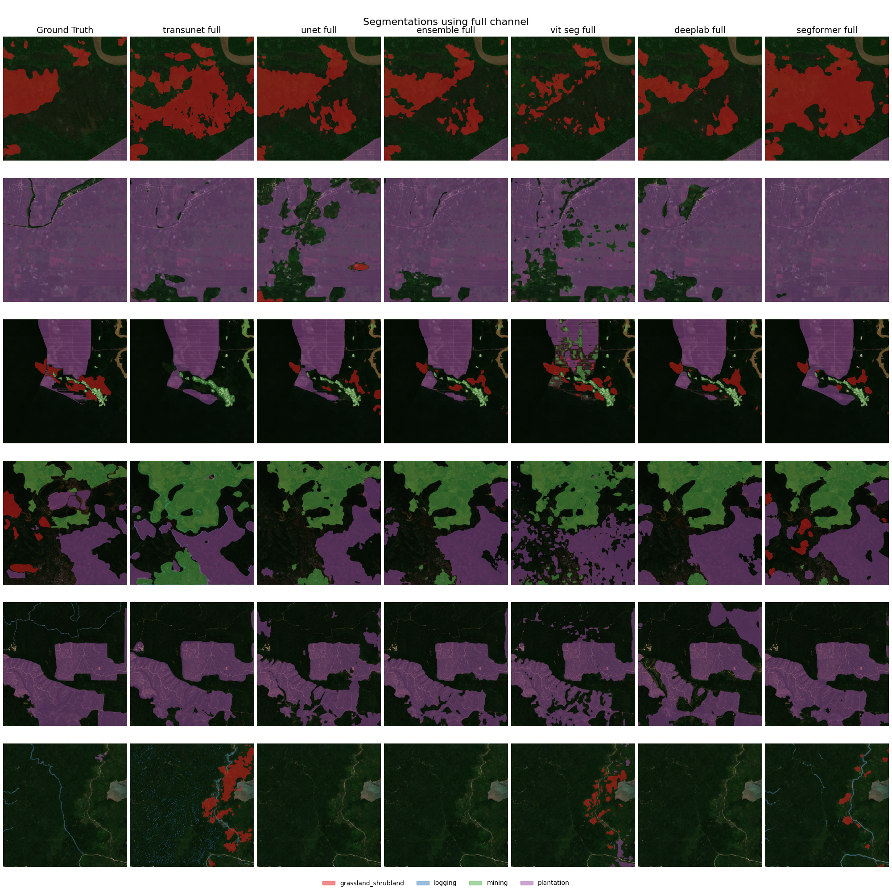
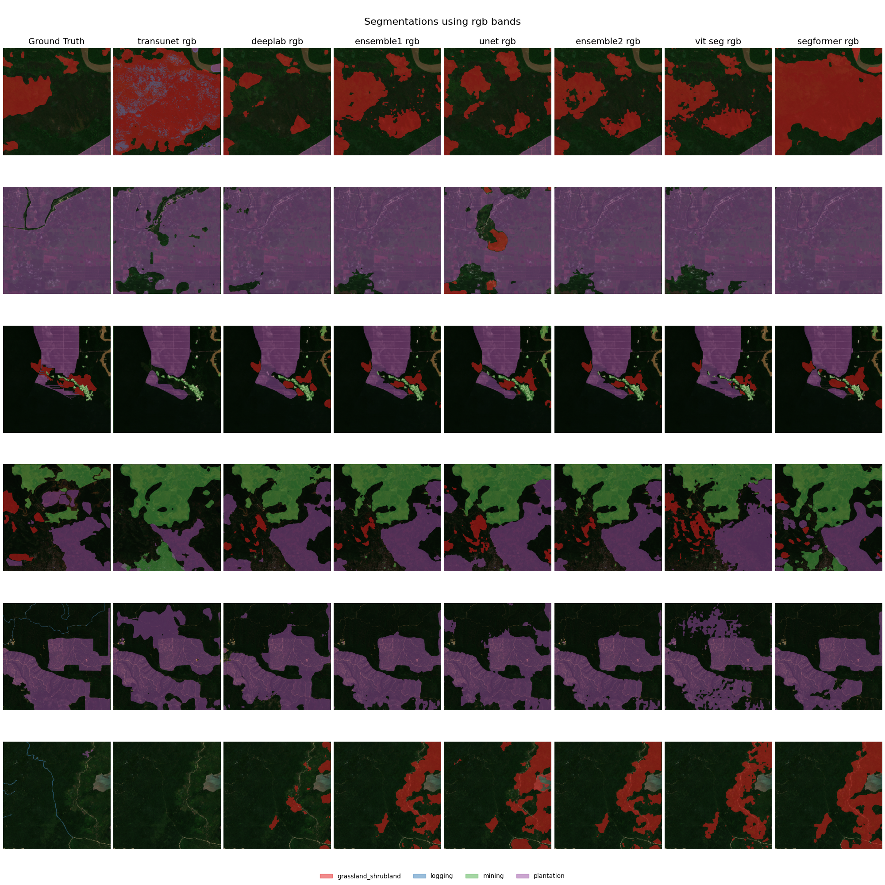
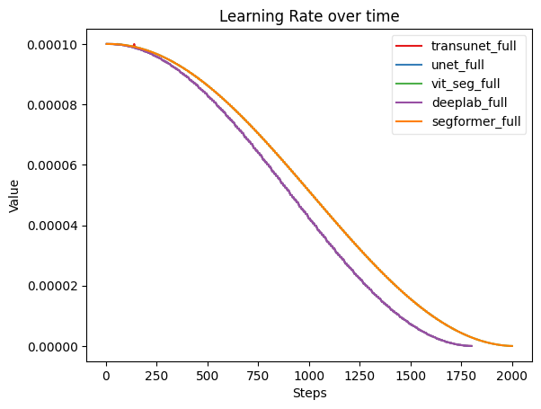
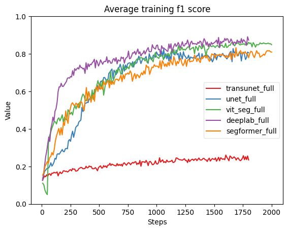
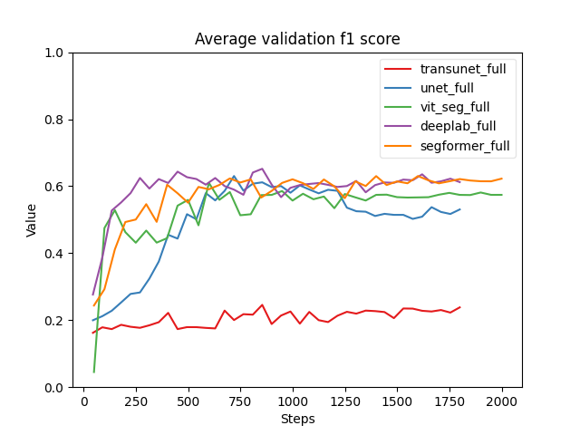
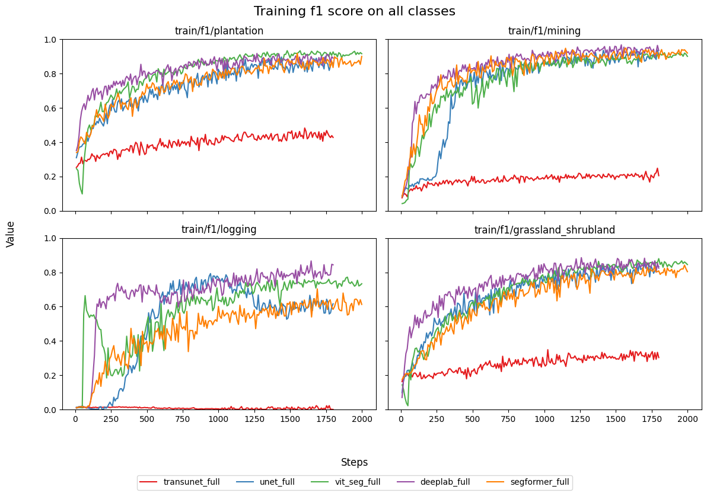
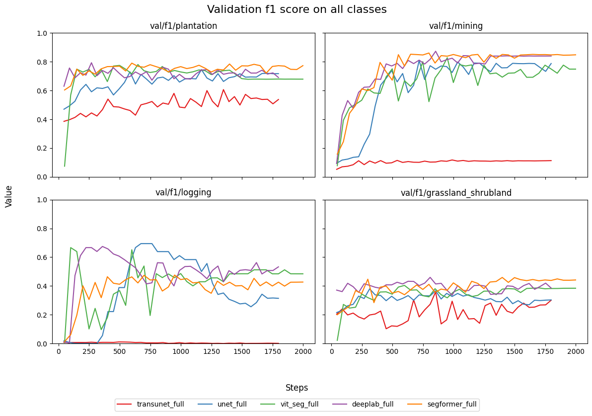

# Abstract

Add abstract when all other sections are complete.

# Introduction

TODO:

- [] Problem description
- [] Related work
- [] Objectives
- [] Our Contributions

In this paper we are working on the task of identifying deforestation drivers.
This is part of a Solafune ML competition[^1] where the goal is to classify and 
segment different causes of deforestation drivers in sattelite imagery.

Several architectures have been developed for image segmentation in different fields,
such as UNet [@ronneberger2015unetconvolutionalnetworksbiomedical] and TransUNet [@chen2021transunet]
for medical image segmentation, or the Segformer [@xie2021segformer] for general purpose 
segmentation.

We have several goals we want to achieve. First, achieve the best performance 
as possible on the competition dataset. Second, compare the different implementations
in terms of performance vs computational cost. Lastly, to produce similar results to 
the papers in which architectures we have implemented.

Our contributions consists of applying different segmentation model architectures 
on a deforestation segmentation task, and comparing their performance.

[^1]: [Competition website](https://solafune.com/competitions/68ad4759-4686-4bb3-94b8-7063f755b43d?menu=about&tab=&modal=%22%22)

# Methods

TODO:

- Explain training pipeline
- Pre-processing
- Post-processing

We have used this github repo as a baseline for our pipeline.[^2]

## Pre-processing

- Generate masks/labels from competition data
- Apply image augmentations
- We do random cropping on half the image size,
    for all models but the Vision Transformer
- normalize image using mean and std calculated from training images.
    depends on number of channels used.

## Post-processing

- scoring threshold of 0.5. 
- A minimum area 10000 to count valid masks (this is not applied during training).

[^2]: [Basline pipeline by motokimura](https://github.com/motokimura/solafune_deforestation_baseline)

## Vision Transformer

[@dosovitskiy2020vit]

## Segformer

SegFormer [@xie2021segformer] is a more efficient model for semantic segmentation that combines the strengths of transformer-based architectures with hierarchical representations typically seen in convolutional networks. For this project, I selected SegFormer as my individual contribution, with the aim of improving the model’s ability to identify deforestation drivers from satellite imagery in the Solafune competition. 

### Model Architecture

SegFormer is composed of two main components:

1. Mix Transformer (MiT) Encoder:
    - The encoder is built on a Transformer-based backbone specifically designed for efficient visual representation learning.
    - Unlike classical Vision Transformers, SegFormer avoids explicit positional encodings, making it more robust to varying image resolutions.
    - It uses overlapping patch embeddings and a hierarchical structure to effectively capture both local and global contexts in the image.
2. All-MLP Decoder:
    - The decoder consists solely of lightweight Multi-Layer Perceptrons (MLPs), which fuse multi-scale features extracted by the encoder.
    - This results in a simple yet highly performant decoding module with low computational overhead, making the model suitable even for resourc constrained environments.

### Implementation

To integrate SegFormer into our pipeline, I used the implementation provided by the *segmentation_models* [@Iakubovskii:2019] library. This choice offered a modular and well-tested framework for segmentation models, enabling easy training and experimentation.

### Why SegFormer?

SegFormer was chosen for several reasons:

- It strikes an excellent balance between accuracy and efficiency, making it suitable for satellite image segmentation where high resolution and scale variation are common.
- The model is available in multiple sizes (B0-B5), allowing flexibility depending on hardware constraints.
- It has achieved strong results on benchmarks such as Cityscapes and ADE20K, indicating strong generalization across segmentation tasks.

## TransUNet

TODO:

- Hybrid encoder
- CNN and Transformer
- Skip connections
- CUP (Cascaded Upsampler)

TransUNet is very similar to its predecessor UNet. It consists of an encoder and decoder.
The main difference in TransUNet is the Introduction of a transformer in the encoder.

- Run with frozen start on N first epochs

![TransUNet architecture [@chen2021transunet]](../trans_unet/img/transunet.png)

## Ensemble Models

We create two ensemble models, one with all models called ensemble1 and one without TransUNet called ensemble2.
Ensemble models average the output logits of all its models. 

## Training and Evaluation

- Batch accumulation depending on batch size for model. 16 or 15 batches.
- Cosine learning rate scheduler form `timm`
- Trained models on RGB and all channels
- Frozen start on Transunet(15 epochs) and ViT(5 epochs)
- evaluation on f1 score

Parameters(million)

| Model | RGB | Full |
| --------------- | --------------- | --------------- |
| UNet | 32.5 | 32.5 |
| DeepLabV3+ | 26.7 | 26.7 |
| Segformer | 82.0 | 82.0 |
| Vision Transformer | 88.8 | 90.6 |
| Transunet | 105 | 105 |

# Results

TODO:

- What we found
- Which model performs the best
- Follow structure of methods section

## Affect of adding minimum area

- Models improves by adding minimum area, especially TransUNet  

| Model           | Without min area | With min area |
| --------------- | --------------- | --------------- |
| unet_rgb        | 0.5961 | 0.6917 |
| deeplab_rgb     | 0.6289 | 0.7159 |
| segformer_rgb   | 0.6174 | 0.7029 |
| vit_seg_rgb     | 0.6652 | 0.7200 |
| transunet_rgb   | 0.2089 | 0.6514 |
| ensemble1_rgb    | **0.6727** | 0.7182 |
| ensemble2_rgb    | 0.6725 | 0.7180 |
| unet_full       | 0.6303 | 0.6906 |
| deeplab_full    | 0.6520 | **0.7367** |
| segformer_full  | 0.6302 | 0.7048 |
| vit_seg_full    | 0.6098 | 0.7072 |
| transunet_full  | 0.2456 | 0.5915 |
| ensemble1_full   | 0.6706 | 0.7335 |
| ensemble2_full   | 0.6698 | 0.7327 |

# Discussion

TODO:

- How do we interpret our results?
- Did we achieve our objectives?

# References
