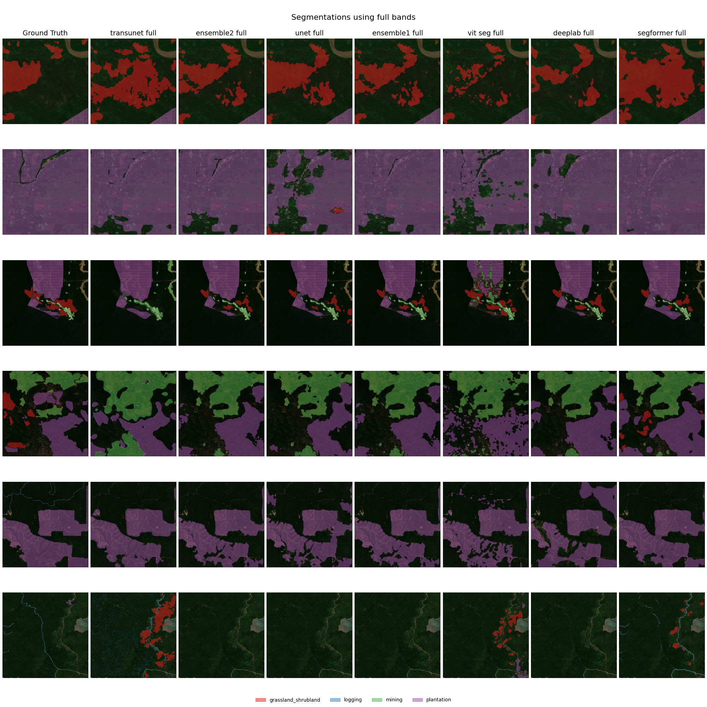

# Abstract
<!--This will be added later ignore-->
Add abstract when all other sections are complete.

# Introduction

In this paper we are working on the task of identifying deforestation drivers.
This is part of a Solafune ML competition[^1] where the goal is to classify and 
segment different causes of deforestation drivers in satellite imagery.

Several architectures have been developed for image segmentation in different fields,
such as UNet [@ronneberger2015unetconvolutionalnetworksbiomedical] and TransUNet [@chen2021transunet]
for medical image segmentation, or the Segformer [@xie2021segformer] for general purpose 
segmentation.

We have several goals we want to achieve. First, achieve the best possible performance
on the competition dataset. 
Second, compare the different implementations in terms of performance vs computational cost.
Lastly, to reproduce results reported in the original architecture papers, which we 
have implemented.

Our contributions consist of applying different segmentation model architectures 
on a deforestation segmentation task, and comparing their performance.

[^1]: [Competition website](https://solafune.com/competitions/68ad4759-4686-4bb3-94b8-7063f755b43d?menu=about&tab=&modal=%22%22)

# Methods

Our entire pipeline is based upon a GitHub repository made by motokimura.[^2]
We have made a couple of modifications to the training and evaluation pipeline,
but the pre- and post-processing steps remains mainly unchanged.

[^2]: [Baseline pipeline by motokimura](https://github.com/motokimura/solafune_deforestation_baseline)

## Pre-processing

The competition data comes in the form of annotated polygons in a json file.
We convert those into tensors of 4 channels.
We apply standard image augmentations such as flipping, scaling and rotation.
Additionally we apply random cropping reducing the input image by half.
The cropping is not applied for the Vision Transformer (ViT) model.
Images are also normalized using mean and standard deviation calculated from
training images. Normalization values depends on the number of input channels, i.e. 
using only RGB or all channels.

## Post-processing

We applied a score threshold of 0.5 to binarize the predicted masks.
Additionally, we discarded predicted masks smaller than 10 000 pixels (applied at inference only).

## Model architectures

We have applied the following model architectures; UNet, DeepLabV3+, Vision Transformer (ViT), 
Segformer, and TransUNet.
We used the Pytorch Segmentation Models library [@Iakubovskii:2019] to implement UNet,
DeepLabV3+, and Segformer, while ViT and TransUNet are implemented following 
their respective papers and source code.

### Vision Transformer (ViT)

[@dosovitskiy2020vit]

### Segformer

SegFormer [@xie2021segformer] is a more efficient model for semantic segmentation that
combines the strengths of transformer-based architectures with hierarchical
representations typically seen in convolutional networks.
For this project, I selected SegFormer as my individual contribution,
with the aim of improving the model’s ability to identify deforestation
drivers from satellite imagery in the Solafune competition. 

#### Model architecture

SegFormer is composed of two main components:

1. Mix Transformer (MiT) Encoder:
    - The encoder is built on a Transformer-based backbone specifically
    designed for efficient visual representation learning.
    - Unlike classical Vision Transformers, SegFormer avoids explicit positional encodings,
    making it more robust to varying image resolutions.
    - It uses overlapping patch embeddings and a hierarchical structure to
    effectively capture both local and global contexts in the image.
2. All-MLP Decoder:
    - The decoder consists solely of lightweight Multi-Layer Perceptrons (MLPs),
    which fuse multi-scale features extracted by the encoder.
    - This results in a simple yet highly performant decoding module with low computational overhead,
    making the model suitable even for resourc constrained environments.

#### Implementation

To integrate SegFormer into our pipeline, I used the implementation provided
by the *segmentation_models* [@Iakubovskii:2019] library.
This choice offered a modular and well-tested framework for segmentation models,
enabling easy training and experimentation.

#### Why SegFormer?

SegFormer was chosen for several reasons:

- It strikes an excellent balance between accuracy and efficiency,
making it suitable for satellite image segmentation where high resolution and scale variation are common.
- The model is available in multiple sizes (B0-B5), allowing flexibility depending on hardware constraints.
- It has achieved strong results on benchmarks such as Cityscapes and ADE20K,
indicating strong generalization across segmentation tasks.

### TransUNet

#### Architecture 

TransUNet is very similar to its predecessor UNet.
It consists of an encoder and decoder architecture,
where the main difference is the introduction of a
transformer in the encoder as seen in Figure \ref{transunet_arch}. 
The decoder block called CUP, short for Cascaded Upsampler,
consists of multiple upsampling blocks,
which is made up of a 2x bilinear upsampler followed by two 
convolutional blocks.
The decoder also uses skip connections from the CNN encoder,
and passes them into the first convolutional block in the 
corresponding upsampling stage.

#### Implementation

In our implementation we use ResNet50-VisionTransformer for the hybrid encoder,
using pre-trained weights loaded from the `timm` library.
We implement the base version of TransUNet as they do in [@chen2021transunet].
Because our inputs have three or more channels, we replaced the ResNet encoder's 
first convolutional layer; the rest of the hybrid encoder remained unchanged.

#### Motivation

According to [@chen2021transunet], TransUNet is an improvement to UNet for the task of medical image 
segmentation. Since we use UNet as one of our baseline models, we were interested 
to see if we could get similar results for our task.

![TransUNet architecture [@chen2021transunet]\label{transunet_arch}](../trans_unet/img/transunet.png)

## Ensemble models

We create two ensemble models, one with all models called `ensemble1` and one without TransUNet called `ensemble2`.
Ensemble models average the output logits of all its models. 
As shown in Results, TransUNet without post-processing performed 
significantly worse than the other models.

## Training and evaluation

<!--Ignore TODO-->
TODO

- Cosine learning rate scheduler form `timm`
- Trained models on RGB and all channels
- Frozen start on Transunet(15 epochs) and ViT(5 epochs)

### Hyperparameters

Across all models, we use a learning rate of 1e-4 and a weight decay of 1e-2, which were found to balance convergence speed and regularization. Training is parallelized using 12 workers to optimize data loading efficiency.

Batch sizes and accumulation steps are tuned based on the computational cost and memory footprint of each model. Lightweight models like UNet and DeepLabV3+ use batch sizes of 8 with accumulation of 2. For more computationally demanding models—such as Vision Transformer, TransUNet, and SegFormer—we reduce the batch size (1–3) and increase the accumulation (5–8) to maintain stable gradient estimates while fitting within GPU memory limits.

Although SegFormer is more efficient than classical transformer-based models, it still requires careful memory handling due to its hierarchical structure. These hyperparameters were chosen to ensure training stability across architectures with very different complexity and resource requirements.

### Loss and Metric

We use the pixel-based F1 score as the evaluation metric, in line with the competition rules. It balances precision and recall based on the overlap between predicted and ground truth masks, computed per class and averaged across the dataset.

To reduce the impact of spurious predictions, we apply a post-processing threshold that removes predicted segments with an area smaller than 10,000 pixels. This *min_area* constraint helps suppress noise and false positives, particularly in models that tend to produce fragmented or uncertain predictions. We found that applying this threshold significantly improved F1 scores—especially for models like TransUNet.

### Batch gradient accumulation

As some of the model are quite large, and we have limited resources.
We decided to use batch gradient accumulation.
Instead of using larger batches, we use smaller `k` batches 
and accumulate the gradients of `N` batches before the backward pass. 
The effective batch size then becomes `kxN`. All models are trained 
on an effective batch size of either 15 or 16.
We used pytorch lightning's built in batch gradient accumulation.

### Learning rate scheduler

{width=60%}

### Channel input

### Frozen start

### Training process

Each model is trained for 200 epochs.
During training we run the model on the validation set 
every 5 epochs. The final version of the model we keep, 
is the one that achieves the highest f1 score throughout training.

### Model selection

Once every model is finished training, we run them 
through our post-processing step, and calculate their validation score.
The model with the highest score is then chosen and used to generate 
the final predictions for the test set, i.e. the competition submission.

# Results

TODO:

- What we found
- Which model performs the best
- Follow structure of methods section

## Effect of adding minimum area

Adding a minimum area for segmentation predictions seem to improve 
model performance quite a lot, as seen in Table \ref{min_area_f1}.
Remarkably, this more than doubled TransUNet's F1 score.

<!--Maybe this should be a part of the methods section?-->
The idea is that removing small segmentations, reduces the 
number of false positive predictions.

\begin{table}[!ht]
\resizebox{6cm}{!}{
    \centering
    \begin{tabular}{lll}
    \hline
        Model & Min area = 0 & Min area = 10k \\ \hline
        unet\_rgb & 0.5961 & 0.6917 \\ 
        deeplab\_rgb & 0.6289 & 0.7159 \\ 
        segformer\_rgb & 0.6174 & 0.7029 \\ 
        vit\_seg\_rgb & 0.6652 & 0.7200 \\ 
        transunet\_rgb & 0.2089 & 0.6514 \\ 
        ensemble1\_rgb & \textbf{0.6727} & 0.7182 \\ 
        ensemble2\_rgb & 0.6725 & 0.7180 \\ 
        unet\_full & 0.6303 & 0.6906 \\ 
        deeplab\_full & 0.6520 & \textbf{0.7367} \\ 
        segformer\_full & 0.6302 & 0.7048 \\ 
        vit\_seg\_full & 0.6098 & 0.7072 \\ 
        transunet\_full & 0.2456 & 0.5915 \\ 
        ensemble1\_full & 0.6706 & 0.7335 \\ 
        ensemble2\_full & 0.6698 & 0.7327 \\ \hline
    \end{tabular}
    }
    \caption{Validation f1 scores with and without Minimum Area of 10k(pixels)}
    \label{min_area_f1}
\end{table}

## Effect of channels

When comparing the models trained on only RGB channels and those trained on all channels,
overall performance improves marginally.

When looking at Figure \ref{full} and Figure \ref{rgb}, both seem to produce
similar segmentations. However, the models trained on only the RGB channels seem to
predict more false positives as seen especially on the final row of predictions.

{width=90%}

{width=90%}

## Training and validation performance

### Overall performance

Most of the models seem to converge around an F1-score of 0.8 during training
and 0.6 on validation, as seen in Figure \ref{f1_train} and Figure \ref{f1_val}[^3].
TransUNet's substantially lower performance is unexpected,
only achieving an F1 score of around 0.2 in both datasets.

{width=60%}

{width=60%}

[^3]: The figures only show the results from models trained on all channels, but results 
are similar for RGB as well. No post-processing is applied here.

### Class-wise performance

Looking at the F1-score of each class in Figure \ref{f1_train_classes} and Figure \ref{f1_val_classes},
we see that most models, except TransUNet, attain a similar performance in the different classes.
They perform slightly better on the training data, which is to be expected. 
All models seem to struggle with the classes `logging` and `grassland_shrubland`, more than `plantation`
and `mining`.

The logging class consists of many small lines as seen in the last two images in Figure \ref{full}, 
and the models either completely ignores those areas, or predicts logging on similar, but unrelated lines.
For the grassland/shrubland class, the models tend to overpredict. Looking at the ground truth, 
it is hard to actually see what the grassland/shrubland area is, as it blends into surrounding vegetation,
making it difficult to distinguish.

{width=80%}

{width=80%}

## Training time

All the models we tried had varying sizes, and took different amount of time to train.
Referring to Table \ref{param_size} and Figure \ref{training_time}, the smallest 
model UNet only needed a third of the time training compared to the largest models 
TransUNet and Vision Transformer. From Table \ref{min_area_f1} we see that there 
is only a marginal increase in performance.

\begin{table}[!ht]
\resizebox{6cm}{!}{
    \centering
    \begin{tabular}{lll}
    \hline
        \textbf{Model} & \textbf{RGB} & \textbf{Full} \\ \hline
        UNet & 32.5 & 32.5 \\ 
        DeepLabV3+ & 26.7 & 26.7 \\ 
        Segformer & 82.0 & 82.0 \\ 
        Vision Transformer & 88.8 & 90.6 \\ 
        Transunet & 105 & 105 \\ \hline
    \end{tabular}
    }
    \caption{Number of parameters(millions) for models with RGB and all channels}
    \label{param_size}
\end{table}

{width=80%}

## Competition performance

Our chosen model for the competition was DeepLabV3+ trained on all channels.
It achieved an f1 score of **0.7367** on the validation data.
On the public leaderboard it achieved a score of **0.5851**,
and on the private leaderboard **0.5624**

# Discussion

<!--Ignore TODO-->
TODO:

- How do we interpret our results?
- Did we achieve our objectives?
- Why did the larger models perform worse then the smaller ones?
- Hyperparameter tuning

# References
