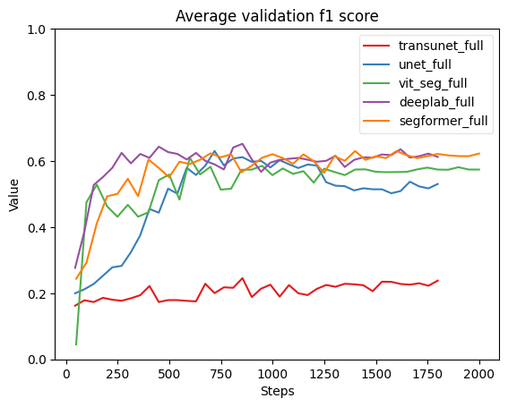

# Abstract

Add abstract when all other sections are complete.

# Introduction

TODO:

- [] Problem description
- [] Related work
- [] Objectives
- [] Our Contributions

In this paper we are working on the task of identifying deforestation drivers.
This is part of a Solafune ML competition[^1] where the goal is to classify and 
segment different causes of deforestation drivers in sattelite imagery.

Several architectures have been developed for image segmentation in different fields,
such as UNet [@ronneberger2015unetconvolutionalnetworksbiomedical] and TransUNet [@chen2021transunet]
for medical image segmentation, or the Segformer [@xie2021segformer] for general purpose 
segmentation.

We have several goals we want to achieve. First, achieve the best performance 
as possible on the competition dataset. Second, compare the different implementations
in terms of performance vs computational cost. Lastly, to produce similar results to 
the papers in which architectures we have implemented.

Our contributions consists of applying different segmentation model architectures 
on a deforestation segmentation task, and comparing their performance.

[^1]: [Competition website](https://solafune.com/competitions/68ad4759-4686-4bb3-94b8-7063f755b43d?menu=about&tab=&modal=%22%22)

# Methods

TODO:

- Explain training pipeline
- Pre-processing
- Post-processing

We have used this github repo as a baseline for our pipeline.[^2]

## Pre-processing

The following pre-processing steps were applied consistently across all models:

- Label Generation: Ground-truth masks were generated from the Solafune competition data,
ensuring consistent class mappings.
- Image Augmentation: We applied several augmentation techniques to improve model robustness, including:
  - Random horizontal and vertical flips
  - Random brightness and contrast adjustments
  - Random rotations and shifts
- Random Cropping:
  - For most models, we performed random cropping to half the original image size
  to increase data variability and focus on finer details.
  - For the Vision Transformer (ViT) model, we retained full image size
  due to the model's architectural sensitivity to input size.
- Normalization:
  - Images were normalized using mean and standard deviation values calculated from the training dataset.
  - Normalization values depend on the number of input channels (e.g., RGB only or RGB + NIR).

## Post-processing

- scoring threshold of 0.5. 
- A minimum area 10000 to count valid masks (this is not applied during training).

[^2]: [Basline pipeline by motokimura](https://github.com/motokimura/solafune_deforestation_baseline)

## Model Architectures

We have applied the following model architectures; UNet, DeepLabV3, VisionTransformer, 
Segformer, and TransUNet.

UNet, DeepLabV3, and Segformer are applied using the pytorch segmentation Models
library[@Iakubovskii:2019], while VisionTransformer and TransUNet are implemented following 
their respective papers and source code.

### Vision Transformer

[@dosovitskiy2020vit]

### Segformer

SegFormer [@xie2021segformer] is a more efficient model for semantic segmentation that
combines the strengths of transformer-based architectures with hierarchical
representations typically seen in convolutional networks.
For this project, I selected SegFormer as my individual contribution,
with the aim of improving the model’s ability to identify deforestation
drivers from satellite imagery in the Solafune competition. 

#### Model Architecture

SegFormer is composed of two main components:

1. Mix Transformer (MiT) Encoder:
    - The encoder is built on a Transformer-based backbone specifically
    designed for efficient visual representation learning.
    - Unlike classical Vision Transformers, SegFormer avoids explicit positional encodings,
    making it more robust to varying image resolutions.
    - It uses overlapping patch embeddings and a hierarchical structure to
    effectively capture both local and global contexts in the image.
2. All-MLP Decoder:
    - The decoder consists solely of lightweight Multi-Layer Perceptrons (MLPs),
    which fuse multi-scale features extracted by the encoder.
    - This results in a simple yet highly performant decoding module with low computational overhead,
    making the model suitable even for resourc constrained environments.

#### Implementation

To integrate SegFormer into our pipeline, I used the implementation provided
by the *segmentation_models* [@Iakubovskii:2019] library.
This choice offered a modular and well-tested framework for segmentation models,
enabling easy training and experimentation.

#### Why SegFormer?

SegFormer was chosen for several reasons:

- It strikes an excellent balance between accuracy and efficiency,
making it suitable for satellite image segmentation where high resolution and scale variation are common.
- The model is available in multiple sizes (B0-B5), allowing flexibility depending on hardware constraints.
- It has achieved strong results on benchmarks such as Cityscapes and ADE20K,
indicating strong generalization across segmentation tasks.

### TransUNet

TODO:

- Hybrid encoder
- CNN and Transformer
- Skip connections
- CUP (Cascaded Upsampler)

#### Architecture 

TransUNet is very similar to its predecessor UNet.
It consists of an encoder and decoder architecture,
where the main difference is the introduction of a
transformer in the encoder as seen in figure \ref{transunet_arch}. 
The decoder block called CUP, short for Cascaded Upsampler,
consists of multiple upsampling blocks,
which is made up of a 2x bilinear upsampler followed by two 
convolutional blocks.
The decoder also uses skip connections from the CNN encoder,
and passes them into the first convolutional block in the 
corresponding upsampling stage.

#### Implementation

In our implementation we use ResNet50-VisionTransformer for the hybrid encoder,
using pre-trained weights loaded from the `timm` library.
We implement the base version of TransUNet as they do in [@chen2021transunet].
As we have are using more than three channels in the input, we had to 
replace the first layer of the resnet encoder. Otherwise the 
hybrid-encoder remains unmodified.

#### Motivation

According to [@chen2021transunet], TransUNet is an improvement to UNet for the task of medical image 
segmentation. Since we use UNet as one of our baseline models, we were interested 
to see if we could get similar results for our task.

![TransUNet architecture [@chen2021transunet]\label{transunet_arch}](../trans_unet/img/transunet.png)

## Ensemble Models

We create two ensemble models, one with all models called `ensemble1` and one without TransUNet called `ensemble2`.
Ensemble models average the output logits of all its models. 
The reasoning for this will become evident in the results section, but 
in short TransUNet without any post-processing performed worse than all other 
models.

## Training and Evaluation

- Batch accumulation depending on batch size for model. 16 or 15 batches.
- Cosine learning rate scheduler form `timm`
- Trained models on RGB and all channels
- Frozen start on Transunet(15 epochs) and ViT(5 epochs)
- evaluation on f1 score

### Hyperparameters

Across all models, we use a learning rate of 1e-4 and a weight decay of 1e-2, which were found to balance convergence speed and regularization. Training is parallelized using 12 workers to optimize data loading efficiency.

Batch sizes and accumulation steps are tuned based on the computational cost and memory footprint of each model. Lightweight models like UNet and DeepLabV3+ use batch sizes of 8 with accumulation of 2. For more computationally demanding models—such as Vision Transformer, TransUNet, and SegFormer—we reduce the batch size (1–3) and increase the accumulation (5–8) to maintain stable gradient estimates while fitting within GPU memory limits.

Although SegFormer is more efficient than classical transformer-based models, it still requires careful memory handling due to its hierarchical structure. These hyperparameters were chosen to ensure training stability across architectures with very different complexity and resource requirements.

### Loss and Metric

We use the pixel-based F1 score as the evaluation metric, in line with the competition rules. It balances precision and recall based on the overlap between predicted and ground truth masks, computed per class and averaged across the dataset.

To reduce the impact of spurious predictions, we apply a post-processing threshold that removes predicted segments with an area smaller than 10,000 pixels. This *min_area* constraint helps suppress noise and false positives, particularly in models that tend to produce fragmented or uncertain predictions. We found that applying this threshold significantly improved F1 scores—especially for models like TransUNet.

### Batch Gradient Accumulation

As some of the model are quite large, and we have limited resources.
We decided to use batch gradient accumulation.
Instead of using larger batches, we use smaller `k` batches 
and accumulate the gradients of `N` batches before the backward pass. 
The effective batch size then becomes `kxN`. All models are trained 
on an effective batch size of either 15 or 16.
We used pytorch lightning's built in batch gradient accumulation.

### Learning rate scheduler

### Channel input

### Frozen start

### Training process

Each model is trained for 200 epochs.
During training we run the model on the validation set 
every 5 epochs. The final version of the model we keep, 
is the one that achieves the highest f1 score throuhout training.

### Model Selection

Once every model is finished training, we run them 
through our post-processing step, and calculate their validation score.
The model with the highest score is then choosen and used to generate 
the final predictions for the test set, i.e. the competition submission.

<!--| Model | RGB | Full |-->
<!--| --------------- | --------------- | --------------- |-->
<!--| UNet | 32.5 | 32.5 |-->
<!--| DeepLabV3+ | 26.7 | 26.7 |-->
<!--| Segformer | 82.0 | 82.0 |-->
<!--| Vision Transformer | 88.8 | 90.6 |-->
<!--| Transunet | 105 | 105 |-->

\begin{table}[!ht]
    \centering
    \begin{tabular}{lll}
    \hline
        \textbf{Model} & \textbf{RGB} & \textbf{Full} \\ \hline
        UNet & 32.5 & 32.5 \\ 
        DeepLabV3+ & 26.7 & 26.7 \\ 
        Segformer & 82.0 & 82.0 \\ 
        Vision Transformer & 88.8 & 90.6 \\ 
        Transunet & 105 & 105 \\ \hline
    \end{tabular}
    \caption{Number of parameters(millions) for models with RGB and all channels}
    \label{param_size}
\end{table}

# Results

TODO:

- What we found
- Which model performs the best
- Follow structure of methods section

## Effect of adding minimum area

<!--| Model           | Without min area | With min area |-->
<!--| --------------- | --------------- | --------------- |-->
<!--| unet_rgb        | 0.5961 | 0.6917 |-->
<!--| deeplab_rgb     | 0.6289 | 0.7159 |-->
<!--| segformer_rgb   | 0.6174 | 0.7029 |-->
<!--| vit_seg_rgb     | 0.6652 | 0.7200 |-->
<!--| transunet_rgb   | 0.2089 | 0.6514 |-->
<!--| ensemble1_rgb    | **0.6727** | 0.7182 |-->
<!--| ensemble2_rgb    | 0.6725 | 0.7180 |-->
<!--| unet_full       | 0.6303 | 0.6906 |-->
<!--| deeplab_full    | 0.6520 | **0.7367** |-->
<!--| segformer_full  | 0.6302 | 0.7048 |-->
<!--| vit_seg_full    | 0.6098 | 0.7072 |-->
<!--| transunet_full  | 0.2456 | 0.5915 |-->
<!--| ensemble1_full   | 0.6706 | 0.7335 |-->
<!--| ensemble2_full   | 0.6698 | 0.7327 |-->

Adding a minimum area for segmentation predictions seems to improve 
model performance quite a lot, as seen in table \ref{min_area_f1}.
Suprisingly this more than doubled the performance of TransUNet.
The idea is that removing small segmentations, reduces the 
number of false positive predictions.

\begin{table}[!ht]
    \centering
    \begin{tabular}{lll}
    \hline
        Model & Without min area & With min area \\ \hline
        unet\_rgb & 0.5961 & 0.6917 \\ 
        deeplab\_rgb & 0.6289 & 0.7159 \\ 
        segformer\_rgb & 0.6174 & 0.7029 \\ 
        vit\_seg\_rgb & 0.6652 & 0.7200 \\ 
        transunet\_rgb & 0.2089 & 0.6514 \\ 
        ensemble1\_rgb & \textbf{0.6727} & 0.7182 \\ 
        ensemble2\_rgb & 0.6725 & 0.7180 \\ 
        unet\_full & 0.6303 & 0.6906 \\ 
        deeplab\_full & 0.6520 & \textbf{0.7367} \\ 
        segformer\_full & 0.6302 & 0.7048 \\ 
        vit\_seg\_full & 0.6098 & 0.7072 \\ 
        transunet\_full & 0.2456 & 0.5915 \\ 
        ensemble1\_full & 0.6706 & 0.7335 \\ 
        ensemble2\_full & 0.6698 & 0.7327 \\ \hline
    \end{tabular}
    \caption{Validation f1 scores with and without min area of 10k}
    \label{min_area_f1}
\end{table}

## Effect of channels

When comparing the models trained on only RGB channels and those trained on all channels,
it seems that in general the performance improves, but only marginally.

When looking at figure \ref{full} and figure \ref{rgb}, both seem to produce
similar segmentations. However, the models trained on only the RGB channels seem to
predict more false positives as seen especially on the final row of predictions.

## Training and validation performance

Most of the models seem to converge around an F1-score of 0.8 during training
and 0.6 on validation, as seen in figure \ref{f1_train} and figure \ref{f1_val}[^3].
It is suprising to see that TransUNet performs so poorly compared to the other models,
only achieving an F1 score of around 0.2 in both datasets.

[^3]: The figures only show the results from models trained on all channels, but results 
are similar for RGB as well.

## Training time

## Competition performance

Our chosen model for the competition was DeepLabV3 trained on all channels.
It achieved an f1 score of **0.7367** on the validation data.
On the public leaderboard it achieved a score of **0.5851**,
and on the private leaderboard **0.5624**

# Discussion

TODO:

- How do we interpret our results?
- Did we achieve our objectives?

# References
