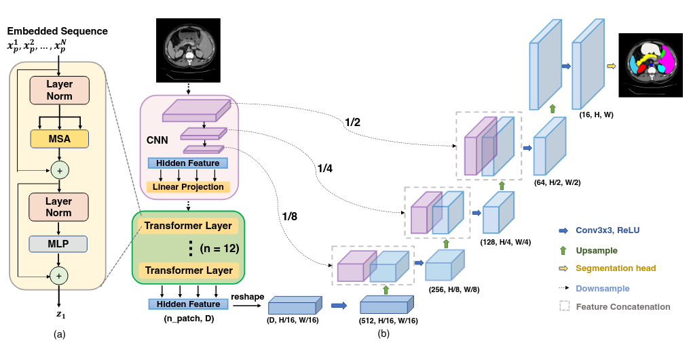

# TransUNet

Implementer: [Simon Vedaa](https://github.com/simsam8)

## Description

The implementation of the TransUNet architecture is as follows:

We use ResNet50-VisionTransformer for the hybrid encoder. 
The encoder is pretrained on ImageNet-21k, and the model is 
loaded from the `timm` library.
The ResNet50 encoder is pretrained on 224x224 images,
and the ViT has a patch size of 16 and uses 12 
transformer layers.

To allow for input with other than 3 channels, we had to 
modify the stem(input layer) of ResNet. Otherwise,
the rest of the hybrid encoder is used as is.

The skip connections consist of the output of the stem 
and the first two stages from ResNet. In the figure below and 
in the paper it looks like they use all the stages and not the stem,
but that is not the case. The last stage has a dimension of 1/16 of the input.

When doing the first upscaling from 1/16 to 1/8, there would be 
a mismatch in dimensions when using the last stage.
This is how they implement it in the official implementation.

The Cascaded Upsampler (CUP) consists of a bridge and three 
decoder blocks.
The bridge takes the reshaped transformer output and changes the number of channels.
The decoder block consists of a bilinear upsampler and two convolutional blocks where the first 
takes in input + skip connection.

The last layer is the segmentation head which consists of another decoder block, but without 
a skip connection, and a final convolutional block that outputs the segmentations.

## Recap Questions

### What new aspect(s) does TransUNet introduce compared to UNet?

- [] Cascaded Upsampler and Skip connections
- [] CNN-Transformer encoder
- [x] CNN-Transformer encoder and Cascaded Upsampler(CUP)
- [] Patch Embeddings

### How does the Hybrid encoder(CNN-Transformer) in TransUNet improve performance?

- [x] Capture better global context while keeping low-level details
- [] It is less computationally expensive
- [] By applying an auto-encoder to learn relevant features
- [] All of the above

## Code references

- [Official TransUNet repo](https://github.com/Beckschen/TransUNet/tree/main)
- [TransUNet implementation example](https://tianjinteda.github.io/Transunet.html)
- [UNet using ResNet50](https://github.com/rawmarshmellows/pytorch-unet-resnet-50-encoder/blob/master/u_net_resnet_50_encoder.py)
