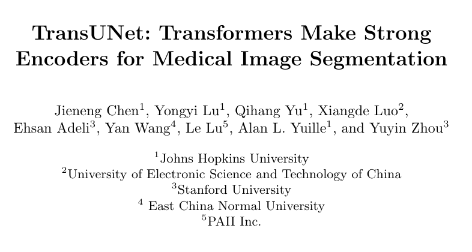
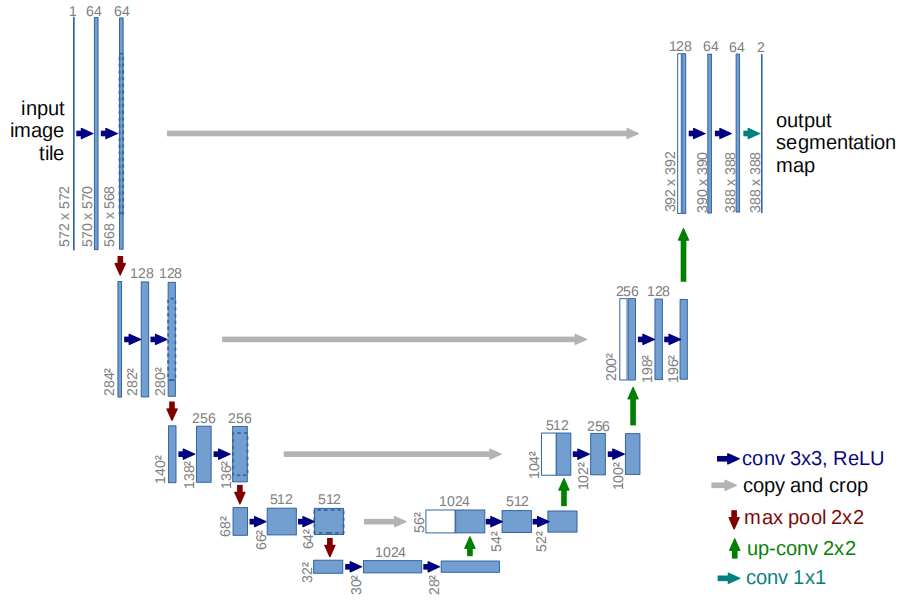
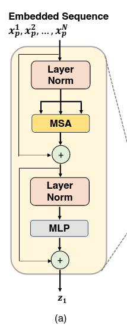
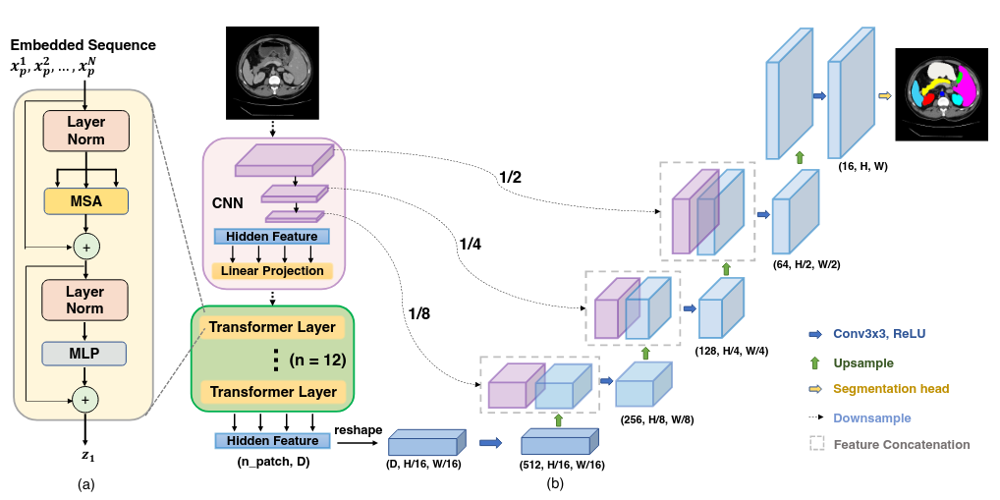
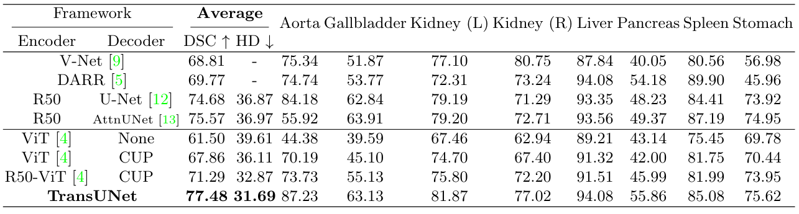
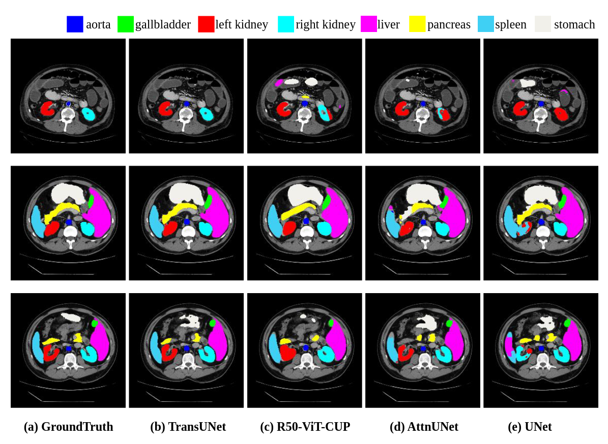
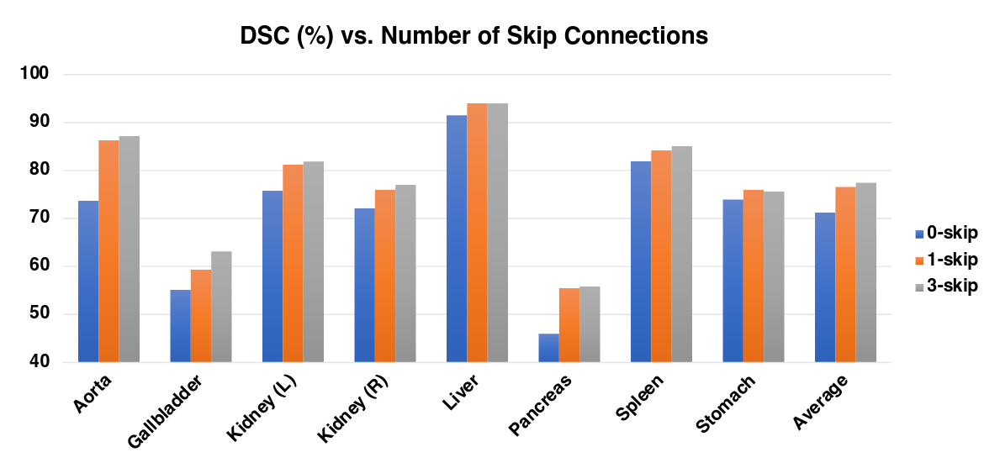
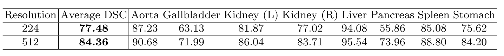
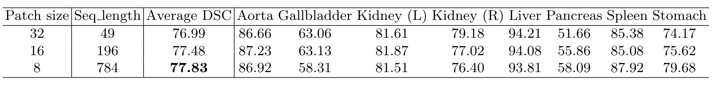
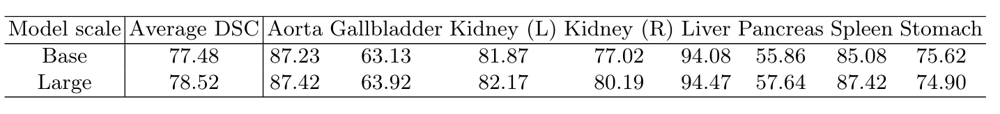

# Introduction

## Background

- U-Net, de-facto choice in medical image segmentation
- Limitations in long-range relation due to locality 
of convolution operations.
- Other studies apply self-attention to CNNs or 
use Transformers instead to capture global contexts.

## UNet

## In this paper

- Study the potential of transformers in medical image segmentation.
- Transformers capture global contexts.
- UNet (CNNs) extracts low-level details.
- TransUNet: a hybrid CNN-Transformer architecture
- Compare with other architectures on medical images segmentation.
- Ablation studies on model parameters

## Relevance for competition (Deforestation Drivers)

- UNet as baseline
- Both are segmentation tasks
- Does TransUNet perform better?

{ width=50% }

{ width=50% }

{ width=50% }

# Method and Architecture

## Transformer as Encoder

- Input image $\mathbf{x} \in \mathbb{R}^{H\times W \times C}$
- Image Sequentialization
- Patch Embeddings
- Naive Upsampling
- Output a $H \times W \times S$ pixel-wise segmentation. 

## Image Sequentialization

- Reshape input $\bf x$ into a sequence of 2D patches.
- {$\mathbf{x}_{p}^{i} \in \mathbb {R}^{P^{2}} \cdot C | i = 1,\dots , N$}
- Each patch is $P \times P$.
- $N = \frac{HW}{P^2}$ is the number of patches, i.e. the sequence length.

## Patch Embedding

:::::::::::::: {.columns}
::: {.column width="50%"}
- Pass patches into a latent D-dimensional embedding space with a trainable linear projection.
- $\mathbf E \in \mathbb R^{P^2 \cdot C) \times D}$ is the patch embedding projection.
- $\mathbf E_{pos} \in \mathbb R^{N\times D}$ is the position embedding.
:::
::: {.column width="50%"}
$z_0 = [x_p^1 \mathbf E ; x_p^2 \mathbf E ; \dots ; x_p^N \mathbf E] + \mathbf E_{pos}$
:::
::::::::::::::

## Transformer Encoder

:::::::::::::: {.columns}
::: {.column width="50%"}
- $L$ layers of Multihead Self-Attention and Multi-Layer Perceptron
- $z_{\ell}' = MSA(LN(z_{\ell - 1})) + z_{\ell - 1}$
- $z_{\ell}' = MLP(LN(z_{\ell}')) + z_{\ell}'$
- $LN(\cdot)$ is the layer normalization
:::
::: {.column width="50%"}

{ height=70% }

:::
::::::::::::::

## TransUNet

- Hybrid CNN and Transformer encoder
- Cascaded Upsampler (CUP)
- Skip connections from CNN

## TransUNet

# Experiments and Results

## Dataset and Evaluation

- Synapse multi-organ segmentation dataset
- CT scans images
- Metrics: Dice Similarity Score (DSC) and Hausdorff Distance (HD)

## Comparison with State-of-the-arts

## Segmentation comparison

# Ablation Studies

## Number of Skip-connections

## Influence of Input Resolution

## Influence of Patch Size/Sequence Length

## Model Scaling

- Parameters for the hidden size D, number of layers, MLP size, and number of heads.
- Base: 12, 768, 3072, 12
- Large: 24, 1024, 4096, 16

