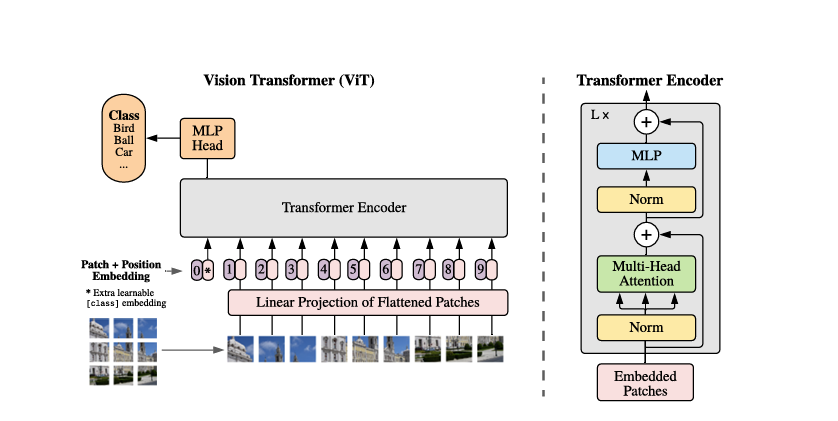

# VisionTransformer

## Description

We trained a semantic segmentation model based on the Vision Transformer (ViT) approach, specifically the ViT-B/16 variant, adapted from the paper “An Image is Worth 16x16 Words” by Dosovitskiy et al. While the original work was designed for image classification, we modified the architecture for segmentation tasks.
Traditionally, CNN-based models like U-Net and DeepLab have dominated segmentation tasks, but recently, transformer-based architecture such as ViT have shown potential for capturing global context in image classification tasks.  
The model is based on the original ViT-B/16 classification architecture for semantic segmentation by adapting its input and output layers. The model is initialized with ImageNet-1k pretrained weights and modified to handle 12-channel Sentinel-2 data to produce segmentation outputs instead of classification using a custom convolutional head. 

The ViT’s initial patch embedding handled layers of 16x16 convolution for RGB inputs, this was modified to accept 12 input channels instead of 3. This allows the model to utilize the full multispectral data. The patch size being 16 yields a 64x64 grid of patches for a 1024x1024 image. 
The learned positional embeddings from the pretrained model, which assumes a smaller patch grid of 14x14 for 224x224 images, were reshaped via 2D interpolation to fit the 64x64 patch grid of our images. This step preserves the spatial positional information for the larger input size. 
The classification head, MLP on the [CLS] token was removed. Instead, a lightweight 1x1 convolution layer was added on top of the transformer encoder outputs to produce per-patch class logits for four segmentation classes. During inference, these patch-level outputs are unsampled back to the full image resolution to form the output mask.
These changes enabled the ViT to generate 4-class segmentation maps from high resolution, multi-spectral imagery. In essence, the model treats each 16x16 patch of the images as a “token” and outputs a predicted deforestation driver class for each patch, which we then map back into the image grid.

ViT leverages transformer’s ability to capture long-range contextual information in images. Unlike convolutional neural networks (CNNs) which embed strong inductive biases into the architecture, the Vision Transformer deliberately uses minimal image-specific inductive bias. 
Dosovitsky et al. (2021) describes that ViT “interprets an image as a sequence of patches” and processes it with a standard Transformer encoder, similar to processing word tokens in NLP. This means the model does not inherently assume any locality or spatial hierarchy beyond the patch level – it relies entirely on self-attention to learn the image structure. 

While the absence of built-in priors makes ViT more data hungry and initially harder to train, it also allows the model to learn global relationships that may be advantageous for complex scenes. In the context of deforestation driver segmentation, global context (e.g. patterns of agriculture fields or plantations) and multi-spectral relationships might be better captured through the ViT’s self-attention mechanism spanning the entire image. 
As reported in the paper the ViT had promising results, with sufficient pre-training, a pure transformer can attain state-of-the-art image recognition performance. The authors explicitly pointed the promises of applying ViT to dense prediction tasks like segmentation. Our work extends this idea by testing ViT on a high-resolution segmentation problem. 

